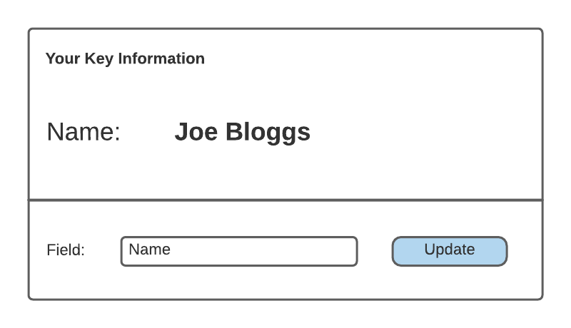

# Lightful Developer Test

## Getting Started

You will need a Salesforce DX environment in order to complete this test. If this is not something you already have, or are not already familiar with, please start with this Trailhed: https://trailhead.salesforce.com/content/learn/projects/quick-start-salesforce-dx

1. Clone this Git repo and open the project in VS Code
2. Use the file stored in `./config/project-scratch-def.json` to create a scratch org to work from and set this as the project default
3. Push the project metadata to the scratch org: `sfdx force:source:push -u [USERNAME]`
3. Publish the 'Delighful' Community: `sfdx force:community:publish -n "Delightful" -u [USERNAME]`
3. Import the sample data: `sfdx force:data:tree:import -f config/test-data-Account-Contact.json -u [USERNAME]`
4. Enable a Contact record as an External User to help you validate your work. Please use the `Delightful Community Plus User` profile. Please note that you will need to create a new user with a role you have created and set this as the owner of the Community User's Contact record.
5. Have a look around the 'Delightful' community

## Task 1

Navigate to the Delightful Test Community Builder. On the homepage, you will find a record deail component and a related list component. Update these components so that they display the details of the Account record related to the logged in user.

Once complete, validate that the functionality in the Delightful Community. Pull the metadata back into your project and commit to the Master branch with the message "Dev Test - Task 1".

## Task 2

Taking note of the existing internal/external account security model, please modify your org and provide a sharing change to support the following user requirement:

**As an External User with the standard Customer Community Plus User profile**  
**I need to be able edit information about Contacts who are part of the same organisaion as me**  
**So I can keep this information up to date**

In the Delightful Trust Community:
1. Can view the Account record that is related to my User
2. Can view all of the Contact records that is related to the same Account record as my User
3. Can edit all Contact records related to the same Account record as my User
4. Can not view any Contact records that are not related to the same Account record as my User

Once complete, validate that the functionality in the Delightful community using the page layouts provided. Pull the metadata back into your project and commit to the Master branch with the message "Dev Test - Task 2".

## Task 3

Please create a LWC that supports the functionality outlined below. The component should be placed in a few of the most relevant  Delightful Test Community.

**As a Delightful Community User**  
**I want a piece of information that is important to me to be displayed prominently on pages where Account and Contact record details are shown to me in the Delightful Community**  
**So that I can easily find the information I need most often**

1. Component functions in the context of the record I am viewing
2. Can define a field whose value displays
3. The label and value of the defined field are displayed to the user
4. The layout of the component matches the wirefame given below
5. The field value I define is saved and the same field is displayed every time I login, until I change it
6. The component is styled to reflect the Lightful brand, as detailed here: http://lightful-brand.com/styleguide

Once complete, validate that the functionality in the Delightful community using the page layouts provided. Pull the metadata back into your project and commit to the Master branch with the message "Dev Test - Task 3". 

Finally, please publish your changes to GitHub and notify us by email at careers@lightful.com.

Thank you for the time you have taken to complete this test, it is very much appreciated!